## Hi there 👋, I'm L0v3ch4n

### Who I am


- 🚩 A ctfer

  <div align="center">
    
   
   
   

  </div>

- ⌨️ A coder
  - full-stack developer&nbsp;&nbsp;~~(I whish I am.)~~
  - Tech Stack:
    - Language:
    <p align="center">
      <picture></picture>      <picture></picture>
    </p>

    - Tools:
    <p align="center">
      <picture></picture>
    </p>

  - IDE I use:
  <p align="center">
    <picture></picture>
  </p>

<!-- Waka Box -->
  <!-- waka-box start -->
#### <a href="https://gist.github.com/4a7eb433b1567bd06dc5d33eaeb5cde9" target="_blank">📊 Weekly development breakdown</a>
```text
Markdown   🕓 1h12m █████▉░░░░░░░░░░░░░░░░░░░░░░ 21.1%
CSS        🕓 1h10m █████▊░░░░░░░░░░░░░░░░░░░░░░ 20.6%
Python     🕓 48m   ███▉░░░░░░░░░░░░░░░░░░░░░░░░ 14.0%
SQL        🕓 32m   ██▌░░░░░░░░░░░░░░░░░░░░░░░░░  9.4%
Go         🕓 27m   ██▏░░░░░░░░░░░░░░░░░░░░░░░░░  8.0%
```
<!-- Powered by https://github.com/YouEclipse/waka-box-go . -->
<!-- waka-box end -->

- 📖 A student
  - Graduate at Nanjing University of Aeronautics and Astronautics
  - Postgraduate student at Zhejiang Gongshang University

- 📫 How to reach me

  <div align="center">
    
   [](https://blog.l0v3ch4n.top)
   [](mailto:lovechan@nuaa.edu.cn)
   [](https://b23.tv/1Y5XwJk)

  </div>

### About My GitHub

#### My GitHub Stats

<!-- GitHub stats -->

<picture>
  <source
    srcset="./profile/stats-dark.svg"
    media="(prefers-color-scheme: dark)"
  />
  
</picture>
<picture>
  <source
    srcset="./profile/top-langs-dark.svg"
    media="(prefers-color-scheme: dark)"
  />
  
</picture>

#### My GitHub Contributions

<!-- GitHub snk -->
<picture>
  <source media="(prefers-color-scheme: dark)" srcset="https://raw.githubusercontent.com/Cuber-Wei/Cuber-Wei/output/github-snake-dark.svg" />
  <source media="(prefers-color-scheme: light)" srcset="https://raw.githubusercontent.com/Cuber-Wei/Cuber-Wei/output/ocean.gif" />
  
</picture>
